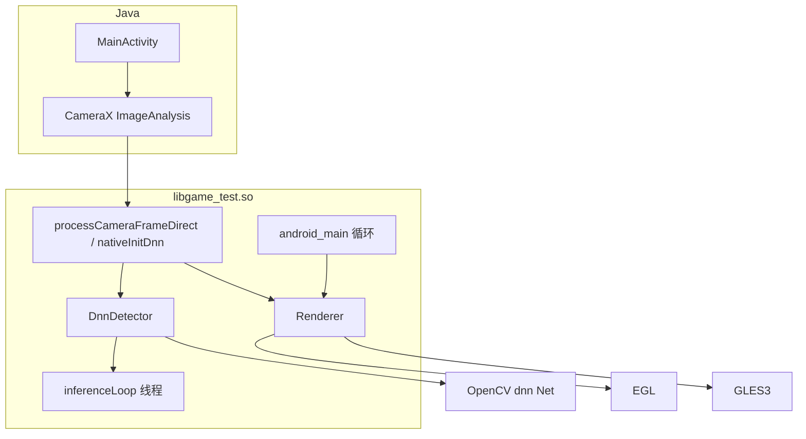
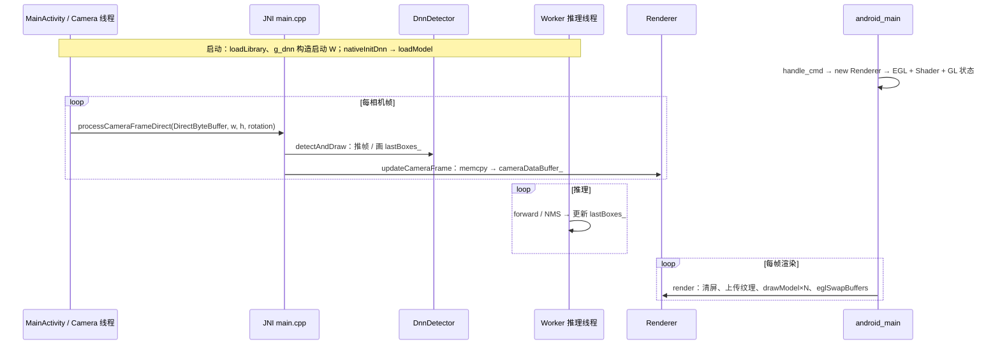
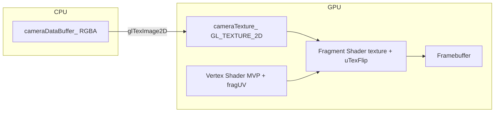

# game_test（app 模块）项目说明

基于 **GameActivity** + **CameraX** + **OpenGL ES 3.0** + **OpenCV DNN（YOLOv5n ONNX）** 的相机预览与目标检测示例：在 Native 侧推理并在 RGBA 上绘制检测框，再上传纹理全屏显示。

---

## 1. 目录与职责

```
app/
├── build.gradle.kts              # 依赖（含 game-activity、CameraX、OpenCV 路径等）
├── src/main/
│   ├── AndroidManifest.xml
│   ├── assets/dnn/yolov5n.onnx   # 推理模型（可替换）
│   ├── java/com/example/game_test/
│   │   └── MainActivity.java     # GameActivity：相机、JNI、模型拷贝
│   └── cpp/
│       ├── CMakeLists.txt        # game_test.so：OpenCV + GLES3 + EGL + game-activity
│       ├── main.cpp              # JNI、android_main、全局 Renderer / DnnDetector
│       ├── Renderer.{h,cpp}      # EGL 上下文、每帧渲染、相机纹理、MVP
│       ├── Shader.{h,cpp}        # 程序对象、VAO/VBO/EBO、drawModel
│       ├── Model.h               # Vertex / Index、Model 数据
│       ├── DnnDetector.{h,cpp}   # ONNX 推理、异步 Worker、CPU 画框
│       ├── TextureAsset.{h,cpp}  # 资源纹理（本流程相机为主，可复用）
│       ├── Utility.{h,cpp}       # GL 错误检查等
│       └── AndroidOut.{h,cpp}    # 日志
└── docs/
    └── PROJECT.md                # 本文档
```

---

## 2. 总体架构（模块关系）



---

## 3. 运行时序（数据流）



更细的线程划分见仓库根目录 `docs/camera-dnn-sequence.md`。

---

## 4. Native 入口与生命周期

| 入口 | 说明 |
|------|------|
| `android_main` | GameActivity 胶库拉起；注册 `onAppCmd`、主循环 `poll` + `render()` |
| `handle_cmd` | `APP_CMD_INIT_WINDOW` → `new Renderer`；`TERM_WINDOW` → `delete`，并同步 `g_renderer` |
| JNI `nativeInitDnn` | 加载 ONNX，`DnnDetector::loadModel` |
| JNI `processCameraFrameDirect` | `detectAndDraw` → `updateCameraFrame`（顺序保证纹理含 CPU 绘制结果） |

---

## 5. 渲染管线（逻辑）



- **顶点着色器**：`gl_Position = uProjection * uView * uModel * vec4(inPosition,1)`；`fragUV` 传入片元。  
- **片元着色器**：`uv = mix` 实现 `uTexFlip` 轴镜像；`outColor = texture(uTexture, uv)`。  
- **背景**：单位四边形 + `uModel = scale(sx,sy)`；**人物框**：单位四边形 + `uModel = T*S`；**uView** = 绕 Z 旋转（对齐 `rotationDegrees`）；**uProjection** = 单位阵。

---

## 6. OpenGL ES 3.0 / EGL 操作整理

### 6.1 初始化（`Renderer::initRenderer`，EGL 上下文 current 之后）

| 阶段 | API / 操作 |
|------|------------|
| EGL | `eglGetDisplay` → `eglInitialize` → `eglChooseConfig` → `ANativeWindow_setBuffersGeometry` → `eglCreateWindowSurface` → `eglCreateContext`(ES 3.0) → `eglMakeCurrent` |
| 着色器 | `glCreateShader` ×2 → `glShaderSource` → `glCompileShader` → `glCreateProgram` → `glAttachShader` ×2 → `glLinkProgram` → `glGetAttribLocation` / `glGetUniformLocation` → `glDeleteShader` ×2 |
| VAO/VBO/EBO | `glGenVertexArrays` → `glGenBuffers` ×2 → `glBindVertexArray` → `glBindBuffer(GL_ARRAY_BUFFER)` → `glVertexAttribPointer` ×2 → `glEnableVertexAttribArray` ×2 → 解绑 VBO/VAO |
| 混合 | `glEnable(GL_BLEND)` → `glBlendFunc(GL_SRC_ALPHA, GL_ONE_MINUS_SRC_ALPHA)` |

### 6.2 每帧 / 尺寸变化（`Renderer::render` / `updateRenderArea`）

| 操作 | API |
|------|-----|
| 视口 | `eglQuerySurface` → `glViewport(0,0,w,h)`（尺寸变化时） |
| 清屏 | `glClearColor` → `glClear(GL_COLOR_BUFFER_BIT \| GL_DEPTH_BUFFER_BIT)` |
| 相机纹理（首帧或更新） | `glGenTextures`(首次) → `glBindTexture(GL_TEXTURE_2D)` → `glTexParameteri`(MIN/MAG_FILTER, WRAP_S/T) → `glPixelStorei(GL_UNPACK_ALIGNMENT,1)` → `glTexImage2D` |
| 使用程序 | `glUseProgram`（`Shader::activate`） |
| Uniform | `glGetUniformLocation`（`uTexture`、`uTexFlip` 等）→ `glUniform1i` / `glUniform2f` → `glUniformMatrix4fv`（`uModel`/`uView`/`uProjection`） |
| 纹理单元 | `glActiveTexture(GL_TEXTURE0)` → `glBindTexture(GL_TEXTURE_2D, cameraTexture_)` |
| 绘制 | `Shader::drawModel`（见下） |
| 呈现 | `eglSwapBuffers` |

### 6.3 `Shader::drawModel`（每次数组几何）

| 操作 | API |
|------|-----|
| VAO/VBO/EBO | `glBindVertexArray` → `glBindBuffer(GL_ARRAY_BUFFER)` → `glBufferData(..., GL_STREAM_DRAW)` → `glBindBuffer(GL_ELEMENT_ARRAY_BUFFER)` → `glBufferData` |
| 可选纹理 | `glActiveTexture` → `glBindTexture`（`Model` 带纹理时） |
| 索引绘制 | `glDrawElements(GL_TRIANGLES, count, GL_UNSIGNED_SHORT, offset 0)` |
| 解绑 | `glBindVertexArray(0)` → `glBindBuffer(GL_ARRAY_BUFFER, 0)` |

### 6.4 资源释放（`Shader::~Shader` / `Renderer::~Renderer`）

| 对象 | API |
|------|-----|
| Shader | `glDeleteVertexArrays` → `glDeleteBuffers` ×2 → `glDeleteProgram` |
| Renderer | `eglMakeCurrent` 解绑 → `eglDestroyContext` / `eglDestroySurface` / `eglTerminate`（相机纹理 ID 若需严谨可补 `glDeleteTextures`） |

### 6.5 着色器资源与顶点属性（摘要）

| 名称 | 类型 | 含义 |
|------|------|------|
| `inPosition` | `in vec3` | 局部空间顶点 |
| `inUV` | `in vec2` | 纹理坐标 |
| `uModel` / `uView` / `uProjection` | `uniform mat4` | 列主序 MVP |
| `uTexture` | `sampler2D` | 纹理单元 0 |
| `uTexFlip` | `vec2` | 是否对 UV 做 `1-u` 镜像（竖屏） |

---

## 7. DnnDetector 与 OpenCV（非 GL）

- **入口**：`detectAndDraw`（相机线程）推送 `pendingFrame_`，用 `lastBoxes_` 在 RGBA 上 `drawLabelsRgba`。  
- **Worker**：`letterbox` → `blobFromImage` → `net_.forward` → 解析 + `NMSBoxes` → 写回 `lastBoxes_`。  
- **后端**：`DNN_BACKEND_OPENCV`，目标可为 `DNN_TARGET_OPENCL_FP16` 等（依 SDK 能力）。

---

## 8. 构建要点

- **`local.properties`**：`opencv.dir` → OpenCV Android SDK 根目录。  
- **CMake**：`find_package(OpenCV REQUIRED CONFIG)`，链接 `game-activity_static`、`EGL`、`GLESv3` 等。  
- **Java**：`System.loadLibrary("game_test")` 与 so 名一致。

---

## 9. 相关文档

- 仓库 `docs/camera-dnn-sequence.md`：多线程时序。  
- 仓库 `docs/performance-optimization.md`：性能与 VBO 等说明（部分历史段落以源码为准）。
