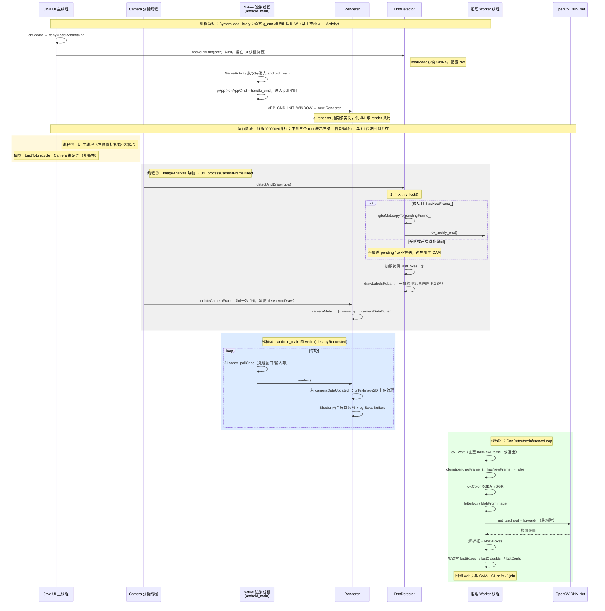

# 相机帧、渲染与 DnnDetector 异步推理时序

描述 **四条业务线程**（外加 JNI / 共享对象）如何协作：`Java UI`、`Camera 分析`、`android_main` 渲染循环、`inferenceLoop` 推理线程，以及 `DnnDetector`、`Renderer`、`OpenCV DNN Net`。

## 四条线程对照

| 编号 | 线程 | 典型代码位置 | 主要职责 |
|------|------|----------------|----------|
| ① | **Java UI 主线程** | `MainActivity` | 生命周期、权限、`ProcessCameraProvider.bindToLifecycle` 等；**不**跑 `ImageAnalysis` 回调 |
| ② | **Camera 分析线程** | `cameraExecutor` + `processCameraFrameDirect` | 每帧 JNI：`detectAndDraw`、`updateCameraFrame` |
| ③ | **Native 渲染线程** | `android_main`（`main.cpp`） | `ALooper_pollOnce`、`Renderer::render`、EGL 交换缓冲 |
| ④ | **推理 Worker** | `DnnDetector` 内 `std::thread` | `inferenceLoop`：`forward`、NMS、更新 `last_*` |

## 其它说明

- **DnnDetector / Renderer** 不是线程，是跨线程访问的 **C++ 对象**；同步靠 `mutex` / `condition_variable`（以及渲染侧 `cameraMutex_`）。
- **线程②** 上 **`drawLabelsRgba`** 使用的是 **已写入 `last_*` 的上一轮（或更早）结果**，与当前推送给 Worker 的帧 **不同步**，属异步折中。
- **`try_lock` 失败** 不等于「推理一定在跑」，仅表示 **当时未拿到 `mtx_`**；成功且 `hasNewFrame_ == true` 时本帧也 **不会** 再次 `copyTo(pendingFrame_)`。
- 另有多条 **系统线程**（Choreographer、Binder、GPU 驱动等），本图只覆盖与应用逻辑直接相关的四条。
